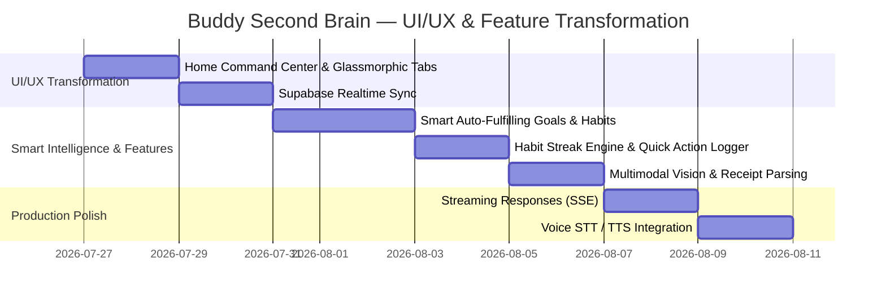

# 🚀 Buddy Second Brain: Master UI/UX Redesign & Cool Feature Expansion Plan

---

## 🎨 Part 1: Complete UI/UX Redesign (Command Center, Glassmorphism & Tabs)

### 1. 🏠 Brand New "Home / Command Center" Page
- **Problem:** Currently, the app opens directly into Chat or generic Analytics graphs without a central **Home Dashboard** showing today's high-level status.
- **Redesign Solution:** Create a modern, high-impact **Home Command Center**:
  - **Hero Greeting Widget:** *"Good morning, Sudhakar! ☀️"* with dynamic daily streak counter, current IST time, and today's weather/mood status.
  - **Quick-Action Floating Bar (1-Tap Fast Logger):** Instant action buttons on the home page (`+ Meal`, `+ Workout`, `+ Expense`, `+ Mood`, `+ Note`) allowing 1-click quick logging without typing full chat prompts.
  - **Daily Metric Summary Pills:** 4 vibrant glassmorphic card widgets:
    - 🍲 **Calories & Nutrition:** E.g. `1,450 / 2,200 kcal` (Daily progress bar)
    - 💻 **Work Hours:** E.g. `5.5 hrs` logged today
    - 💳 **Daily Expense:** E.g. `₹350` spent today
    - 😴 **Sleep:** E.g. `7.5 hrs` last night
  - **Active Smart Goals Widget:** Circular & linear progress bars for active daily & weekly goals.
  - **Live Today's Timeline Feed:** Real-time stream of today's activities with category tags and instant edit/delete capabilities.

---

### 2. 🗂️ Redesigned Modern Navigation & Tab System
- **Problem:** Plain dark sidebar and basic mobile bottom nav.
- **Redesign Solution:**
  - **Translucent Glassmorphic Navigation:** `backdrop-filter: blur(24px)`, subtle glowing borders (`rgba(255, 255, 255, 0.08)`), active indicator glows, and hover micro-animations.
  - **6 Dedicated Refined Tabs:**
    1. 🏠 **Home:** Daily Command Center, metric pills, quick action logger, and live feed.
    2. 💬 **AI Companion Chat:** Full-screen conversational AI with voice STT, vision attachment, and top-right HUD undo toast.
    3. 🎯 **Goals & Habits:** Goal progress tracking, habit streak flames, and deadline timers.
    4. 📊 **Analytics & Insights:** Deep dive metrics, charts, AI Coach Weekly Digest, and Life Correlation Matrix.
    5. 🍳 **Pantry & Cookbook:** Ingredient stock tracker, expiry badges, and AI Chef recipe generator.
    6. ⚙️ **Configuration:** AI Provider picker (Gemini, Groq, OpenAI, Anthropic), API keys, timezone, and data export/import.

---

### 3. 📱 Premium Mobile Bottom Floating Dock
- iOS-style floating bottom navigation pill with glassmorphism, active tab pill indicators, and smooth touch animations.

---

## 🌟 Part 2: New Cool Features & Life Engine Extensions

### 🎯 Feature 1: Smart Auto-Fulfilling Goals & Habits Engine
- **Capabilities:**
  - Set Daily (`run 5km`), Weekly (`read 50 pages`), Monthly (`save ₹15,000`), or Deadline (`finish proposal by Friday 5 PM`) goals.
  - **Auto-Cross-Fulfillment:** When you log `ran 5.2 km` or `spent ₹350 on food`, Buddy automatically updates your pending goals, recalculates percentage progress, and celebrates completed achievements with interactive cards!

---

### 🔥 Feature 2: Habit Tracker & Glowing Streak System
- Track daily habits (*Morning Meditation*, *No Junk Food*, *Deep Coding 2h*, *Gym Session*).
- Visual **Streak Flames (🔥 7 Day Streak!)** on the Home Command Center to gamify positive daily routines.

---

### 💡 Feature 3: Life Correlation & Insight Matrix
- Automatically discovers hidden relationships across your lifestyle logs:
  - **Sleep vs. Stress:** Identifies if sleeping < 6 hours triggers higher `mood: frustrated` frequency.
  - **Coffee vs. Sleep Quality:** Correlates late afternoon caffeine logs with sleep duration.
  - **Work vs. Spending:** Discovers if long work days lead to higher food delivery expenses.

---

### 🎙️ Feature 4: Hands-Free Voice Companion & Audio Playback
- **Speech-to-Text (STT):** Integrated Web Audio recorder + Whisper API for 1-click hands-free logging while walking, driving, or working out.
- **Text-to-Speech (TTS):** Toggleable natural voice responses for hands-free audio companion updates.

---

### 📸 Feature 5: Multimodal Receipt & Meal Vision Parser
- **Receipt Parser:** Snap a receipt photo to automatically extract itemized breakdown, tax, merchant name, and total amount into `expense` category.
- **Meal Nutrition Vision:** Snap a food photo to estimate calories and macro ratios (protein, carbs, fat).

---

### 🔔 Feature 6: Proactive Morning Briefing & Evening Check-In
- **Morning Briefing (08:00 AM):** 3-bullet morning overview of scheduled tasks, pending goals, and weather/health tips.
- **Evening Reflection (09:00 PM):** Buddy summarizes daily accomplishments and prompts a gentle 1-line evening reflection.

---

## 🏛️ Part 3: Architecture & Real-Time Production Standards

### Pillar 1: Supabase Realtime WebSocket Synchronization
- Subscribe to `postgres_changes` on `entries` table.
- When an entry is logged in chat or quick logger, **Home Command Center cards, Analytics charts, and Timeline update instantly with zero page refreshes**.

```typescript
// Proposed Client Realtime Subscription Hook (src/hooks/useRealtimeEntries.ts)
useEffect(() => {
  const channel = supabase
    .channel('schema-db-changes')
    .on('postgres_changes', { event: '*', schema: 'public', table: 'entries' }, (payload) => {
      handleRealtimeUpdate(payload);
    })
    .subscribe();
  return () => { supabase.removeChannel(channel); };
}, []);
```

---

### Pillar 2: Edge Function Modular Architecture
- Modularize `supabase/functions/message/index.ts` into clean domain files (`intentClassifier.ts`, `stateMachine.ts`, `ragRetriever.ts`, `goalEngine.ts`, `promptBuilder.ts`).

---

### Pillar 3: Streaming Responses (Server-Sent Events / SSE)
- Deliver token chunks incrementally to `ChatView.tsx` so Buddy's answers stream word-by-word with typewriter animation.

---

## 🗓️ Implementation Roadmap



---

## 📋 Verification & Validation Plan

### Automated Testing
- Unit test suite for edge function domain modules (`deno test`).
- Test database RPCs (`match_entries`, `get_aggregate_stats`) with synthetic datasets.

### Manual Verification
- **Realtime Sync Verification:** Open Home Command Center on window 1 and Chat on window 2. Log a workout in chat and verify real-time metric pill update without refresh.
- **UI/UX Verification:** Test Glassmorphic navigation tabs across desktop and mobile screen sizes.
- **Goal Auto-Fulfillment Verification:** Set a goal `"run 5km"` and log `"ran 5.5km"`. Verify goal status changes to `completed` and celebratory card renders.
