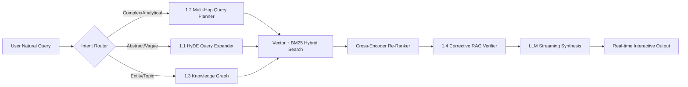
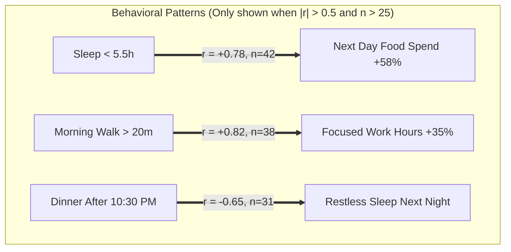

# 🌌 Buddy Second Brain — Revised Master Blueprint (v2)

**28 features** across **7 categories**, with realistic effort estimates, honest ROI assessments, and clear Daily Driver vs Cool Demo classifications.

> [!IMPORTANT]
> **Changes from v1**: Effort estimates doubled to be realistic. Title-only entries removed or fleshed out. 5 missing foundational features added. Minimum data thresholds added for analytics. Features honestly tagged as 🟩 Daily Driver or 🟨 Cool Demo.

---

## 🧭 Blueprint Index
- [0. 🔐 Foundational Infrastructure (MUST-HAVE)](#0--foundational-infrastructure-must-have)
- [1. 🧠 Next-Gen AI, RAG & Cognitive Reasoning](#1--next-gen-ai-rag--cognitive-reasoning)
- [2. 💬 Real-Time Conversational Experience & Interactive UI](#2--real-time-conversational-experience--interactive-ui)
- [3. 📊 Predictive Analytics, Habit Intelligence & Data Science](#3--predictive-analytics-habit-intelligence--data-science)
- [4. 🍲 Smart Kitchen, Nutrition & Pantry Automation](#4--smart-kitchen-nutrition--pantry-automation)
- [5. 📱 Multi-Modal Ingestion, Voice & External Integrations](#5--multi-modal-ingestion-voice--external-integrations)
- [6. ⚡ Database, Performance & Caching](#6--database-performance--caching)
- [🎯 Final Implementation Matrix & Recommended Build Order](#-final-implementation-matrix--recommended-build-order)

---

# 0. 🔐 Foundational Infrastructure (MUST-HAVE)

> [!CAUTION]
> These are not "features" — they are **architectural prerequisites** that the app currently lacks. Without them, many advanced features (multi-user, mobile, trust) are impossible. Build these before anything flashy.

### 0.1 Multi-User Authentication & Row-Level Security (RLS)
🟩 **Daily Driver** | Effort: **3–4 Days**

* **Current Problem**: `userId = 1` is hardcoded throughout the Edge Functions and client. The Supabase `entries` table has no Row-Level Security policies. Anyone with the anon key can read/write all data.
* **The Fix**:
  1. Enable Supabase Auth (email/password or magic link).
  2. Add RLS policies on `entries`, `pantry`, `recipes` tables: `auth.uid() = user_id`.
  3. Replace hardcoded `userId = 1` in the client with `supabase.auth.getUser()`.
  4. Add a login/signup screen.
* **Why It Matters**: If you ever share the app with a friend, deploy it publicly, or even accidentally expose the URL, all your private diary data is completely unprotected right now.

---

### 0.2 Offline Support & Progressive Web App (PWA)
🟩 **Daily Driver** | Effort: **2–3 Days**

* **Current Problem**: The app only works with an internet connection. If you're on the subway, in a dead zone, or your WiFi drops, you cannot log anything.
* **The Fix**:
  1. Add a Service Worker with Vite PWA plugin (`vite-plugin-pwa`).
  2. Implement an IndexedDB queue for offline entries.
  3. On reconnection, flush the queue to Supabase in order.
  4. Add a `manifest.json` for installable home screen icon on mobile.
* **Before vs. After**:
  | Scenario | Before | After |
  | :--- | :--- | :--- |
  | **No internet at 2 AM** | App shows error. Entry lost. | Entry queued locally. Syncs automatically when WiFi returns. Toast: *"Synced 3 offline entries."* |
  | **Phone home screen** | Must open Chrome → type URL → wait for load. | 1-tap app icon launches instantly like a native app. |

---

### 0.3 Undo / Edit History & Audit Trail
🟩 **Daily Driver** | Effort: **1–2 Days**

* **Current Problem**: If the LLM misparses *"worked 4h"* as *"worked 40h"*, there's no way to see what was changed. If you accidentally confirm an overwrite, the original data is gone forever.
* **The Fix**:
  1. Add an `entry_history` table that stores the previous version before any update/delete.
  2. Add a PostgreSQL trigger: `BEFORE UPDATE OR DELETE ON entries → INSERT INTO entry_history`.
  3. Surface a small "History" icon on each entry in the Timeline view.
* **Before vs. After**:
  - **Before**: Accidentally overwrite sleep from 8h → 3h. No way to recover.
  - **After**: Click ↩️ on the entry → see all previous versions → 1-click restore.

---

### 0.4 Robust Relative Date Parser
🟩 **Daily Driver** | Effort: **1 Day**

* **Current Problem**: The classifier handles *"today"*, *"yesterday"*, *"tomorrow"*, and *"N days"* but fails on natural phrases like *"day before yesterday"*, *"last Tuesday"*, *"2 weeks ago on Friday"*, *"the 15th"*.
* **The Fix**: Add a dedicated `parseRelativeDate(text: string): Date | null` function in `classifier.ts` using regex cascades for Indian English patterns:
  - `"day before yesterday"` → today - 2
  - `"last Monday"` → most recent Monday
  - `"3 weeks ago"` → today - 21
  - `"the 25th"` → 25th of current month (or previous month if already passed)
* **Impact**: Every category (meal, sleep, expense, work, exercise) benefits from accurate date resolution. Currently, logs for *"day before yesterday"* get today's timestamp.

---

### 0.5 Error Recovery & Provider Fallback UX
🟩 **Daily Driver** | Effort: **1 Day**

* **Current Problem**: When all LLM providers fail (rate limits, network errors), the user sees a generic red error message with no indication of what happened or what to do.
* **The Fix**:
  1. Surface the fallback chain status in the UI: *"⚡ Groq unavailable, served by Gemini"*.
  2. Add a retry button on failed messages instead of requiring the user to retype.
  3. Cache the last unsent message so it survives a page refresh.

---

# 1. 🧠 Next-Gen AI, RAG & Cognitive Reasoning



### 1.1 HyDE (Hypothetical Document Embeddings) & Multi-Query Expansion
🟩 **Daily Driver** | Effort: **2–3 Days**

* **The Mechanism**: When a user's query is brief or conceptual, direct cosine similarity fails because logs describe specific events, not abstract concepts. HyDE uses a fast LLM to generate 3 hypothetical log entries that *would* answer the query, embeds each hypothetical log, and searches them in parallel using reciprocal rank fusion.
* **Technical Implementation**:
  1. In `retriever.ts`, before calling `getEmbedding(effectiveQuery)`, check if the query is "abstract" (no concrete category keywords, no numbers, no dates).
  2. If abstract: call `callLLM()` with a prompt: *"Generate 3 example personal diary log entries that would answer the question: '{query}'. Return only the 3 entries, one per line."*
  3. Embed all 3 hypothetical logs + the original query (4 vectors total).
  4. Run `hybrid_match_entries` RPC for each vector, merge results with RRF.
* **Before vs. After**:
  | Query | Before | After |
  | :--- | :--- | :--- |
  | *"when did I splurge?"* | 0 results (no log contains "splurge"). | HyDE generates: `["spent 1200 dining out", "bought expensive headphones", "shopping 3500"]` → retrieves all high-spend entries. |
  | *"times I had poor recovery"* | Returns only logs with the word "recovery". | Expands to `["slept 4 hours waking up tired", "sore legs after heavy workout", "exhausted mood"]` → retrieves poor sleep + fatigue logs. |
  | *"days I was super productive"* | Vague match on "productive" word. | Expands to `["worked 8 hours on frontend", "completed 3 tasks", "focused deep work session"]` → retrieves high-output work days. |

---

### 1.2 Multi-Hop Temporal Reasoning & Query Planner
🟨 **Cool Demo** | Effort: **4–5 Days**

* **The Mechanism**: Decomposes multi-stage comparative questions into sequenced sub-queries, executes each against PostgreSQL, joins data in memory, and feeds the resulting matrix into synthesis.
* **Technical Implementation**:
  1. Add a `planQuery()` function that uses a fast LLM to decompose a complex question into 2–4 SQL-like sub-queries.
  2. Execute each sub-query as a separate Supabase `.from('entries')` call.
  3. Join results by `entry_date` in JavaScript.
  4. Feed the joined tabular data into synthesis with a "comparative analysis" system prompt.
* **Before vs. After**:
  | Complex Query | Before | After |
  | :--- | :--- | :--- |
  | *"Do I sleep better on days I exercise in the morning vs evening?"* | Retrieves arbitrary sleep + exercise logs without date-pairing. Gives vague advice. | Step 1: Groups exercise logs into `Morning (<12PM)` and `Evening (>5PM)`. Step 2: Joins with that night's sleep. Step 3: *"Morning workouts → 7.8h avg sleep. Evening workouts → 6.2h avg sleep (restless)."* |
  | *"Am I spending more on food delivery on days I skip cooking?"* | Returns all expense logs and all meal logs separately. | Identifies days with no `meal` log where `meal_type=breakfast/lunch/dinner`, cross-references with `expense` logs where `subcategory=food`. Returns exact comparison. |

> [!NOTE]
> This feature is powerful but complex. It requires careful prompt engineering to prevent the query planner from generating invalid sub-queries. Start with 3–4 hardcoded query templates before attempting fully dynamic decomposition.

---

### 1.3 Graph-RAG: Knowledge Graph & Entity Linking
🟨 **Cool Demo** | Effort: **7–10 Days**

* **The Mechanism**: Extracts recurring named entities (people, projects, places, tools) from every log entry into a relational graph stored in PostgreSQL (`entities` and `entry_entities` junction table).
* **Schema**:
  ```sql
  CREATE TABLE entities (
    id UUID PRIMARY KEY DEFAULT gen_random_uuid(),
    user_id INT REFERENCES users(id),
    name TEXT NOT NULL,
    entity_type TEXT CHECK (entity_type IN ('person', 'project', 'place', 'tool', 'food', 'other')),
    first_seen TIMESTAMPTZ,
    last_seen TIMESTAMPTZ,
    mention_count INT DEFAULT 1
  );

  CREATE TABLE entry_entities (
    entry_id UUID REFERENCES entries(id) ON DELETE CASCADE,
    entity_id UUID REFERENCES entities(id) ON DELETE CASCADE,
    relationship TEXT, -- 'worked_on', 'met_with', 'visited', 'consumed', 'purchased'
    PRIMARY KEY (entry_id, entity_id)
  );
  ```
* **Before vs. After**:
  | Query | Before | After |
  | :--- | :--- | :--- |
  | *"Everything about Project Phoenix"* | Only matches logs containing "Phoenix" literally. | Traverses graph: all work logs, meetings with team members, related expenses (server hosting, tools), blockers, and deadline reminders linked to Phoenix. |

> [!WARNING]
> This is a **1–2 week project** minimum (schema design + entity extraction pipeline + deduplication + query traversal). Do not attempt this until you have 3+ months of log data to populate the graph meaningfully.

---

### 1.4 Corrective RAG (CRAG) & Grounding Verifier
🟩 **Daily Driver** | Effort: **2 Days**

* **The Mechanism**: After retrieval and re-ranking, an evaluator step scores how well the retrieved documents actually answer the user's question. If confidence is low (<0.40), Buddy explicitly says what's missing instead of hallucinating.
* **Technical Implementation**:
  1. After `rerankLogs()`, compute a simple relevance heuristic: `avgTermScore / queryTerms.length`.
  2. If score < threshold AND retrieved count < 3: prepend a grounding instruction to the synthesis prompt: *"IMPORTANT: Retrieved context is sparse or potentially irrelevant. If you cannot confidently answer from the logs below, explicitly tell the user what data is missing rather than guessing."*
* **Before vs. After**:
  - **Before**: User asks *"How much did I spend on Uber last month?"* → No Uber logs exist → LLM fabricates: *"You spent approximately ₹800 on Uber."*
  - **After**: *"I don't have any transport/Uber expense logs for July. You may not have logged those trips. Would you like to add them retroactively?"*

---

### 1.5 Agentic Tool-Use & In-Database Code Interpreter
🟨 **Cool Demo** | Effort: **4–5 Days**

* **The Mechanism**: For complex mathematical queries (standard deviation, percentiles, year-to-date comparisons), Buddy writes and executes a sandboxed SQL snippet via Supabase's `execute_sql` RPC rather than relying on LLM arithmetic (which is notoriously unreliable for large datasets).
* **Before vs. After**:
  | Query | Before | After |
  | :--- | :--- | :--- |
  | *"What's my average daily spend and standard deviation this month?"* | LLM attempts mental math on 15 expense rows. Often gets it wrong by ±₹50–200. | Buddy generates and executes: `SELECT AVG(amount), STDDEV(amount) FROM expenses WHERE month = 8`. Returns exact: *"Average: ₹287/day, Std Dev: ₹142."* |

---

# 2. 💬 Real-Time Conversational Experience & Interactive UI

### 2.1 Server-Sent Events (SSE) Real-Time Token Streaming
🟩 **Daily Driver** | Effort: **3–4 Days**

* **The Mechanism**: Replace the current bulk JSON response with streaming HTTP using `ReadableStream` and `text/event-stream` content type.
* **Technical Implementation**:
  1. **Edge Function (`index.ts`)**: For QUERY and CHAT intents, wrap the LLM call in a `ReadableStream` that yields `data: {token}\n\n` chunks as they arrive from the provider.
  2. **Client (`ChatView.tsx`)**: Replace `fetch().then(json)` with `EventSource` or `fetch()` with `response.body.getReader()` that progressively appends tokens to the message bubble.
  3. **Challenge**: LOG intent still needs full JSON parsing before database insertion. Solution: Stream the `acknowledgment` field only; parse the structured JSON server-side before streaming begins.
* **Before vs. After**:
  | Metric | Before | After |
  | :--- | :--- | :--- |
  | **Time to First Word** | 3.5 – 5.5 seconds (full JSON wait). | **150 – 250ms** (first token appears instantly). |
  | **Reading Experience** | Entire block drops in at once, causing layout shift. | Words flow naturally like a real conversation. |
  | **Perceived Speed** | Feels sluggish and robotic. | Feels alive and responsive. |

---

### 2.2 In-Chat Interactive Table Grid & Inline Log Editor
🟩 **Daily Driver** | Effort: **4–5 Days**

* **The Mechanism**: When Buddy returns a markdown table in a QUERY response, the `MessageBubble.tsx` renderer detects table patterns and renders them as interactive React components with editable cells, sort headers, and action buttons.
* **Technical Implementation**:
  1. In `MessageBubble.tsx`, detect markdown table blocks in the rendered output.
  2. Replace static `<table>` with a `<EditableLogTable>` component that:
     - Renders each row with an `entry_id` data attribute (requires the LLM to include IDs in output, or a post-processing step to match rows to database entries).
     - Clicking a cell switches it to an `<input>` field.
     - On blur/Enter, calls `supabase.from('entries').update({...}).eq('id', entryId)`.
     - Shows ✅ on success, with a 5-second undo toast.
  3. Add 🗑️ delete button per row with confirmation.
* **Before vs. After**:
  - **Before**: To fix ₹200 → ₹180, type: *"Buddy, change my dinner expense to 180"* → waits 4 seconds → hope it updates the right one.
  - **After**: Click `₹200` cell → type `180` → Enter → instant green checkmark. Done in 2 seconds.

---

### 2.3 Contextual Action Pills & Follow-Up Suggestions
🟩 **Daily Driver** | Effort: **1–2 Days**

* **The Mechanism**: After every Assistant response, display 2–3 clickable chips that auto-send a follow-up query when tapped.
* **Technical Implementation**:
  1. Add a `suggestions` field to the Edge Function JSON response schema.
  2. In the synthesis prompt, instruct the LLM: *"Also return a 'suggestions' array of 2–3 short follow-up queries the user might want to ask next."*
  3. In `MessageBubble.tsx`, render these as styled pill buttons below the message.
  4. `onClick` → auto-populate the input box and send.
* **Examples by context**:
  | After This Response | Suggested Pills |
  | :--- | :--- |
  | Showing today's expense table | `[ 📊 Category Breakdown ]` `[ 📈 Compare with Last Week ]` `[ 🎯 Set Budget ]` |
  | Logging breakfast | `[ 💧 Log Water ]` `[ 😴 How Did You Sleep? ]` `[ 💻 Start Work Log ]` |
  | Showing sleep data | `[ 🏃 Exercise This Week ]` `[ 📉 Sleep vs Mood Trend ]` |

---

### 2.4 Power-User Slash Commands (`/`)
🟩 **Daily Driver** | Effort: **1 Day**

* **The Mechanism**: Client-side command palette triggered by typing `/` in the input box. These execute instantly without hitting the LLM.
* **Commands**:
  | Command | Action | Backend? |
  | :--- | :--- | :--- |
  | `/today` | Fetch & display today's logs summary | Direct Supabase query, no LLM |
  | `/budget` | Show current month spent vs target | Direct Supabase aggregate |
  | `/streak` | Show active logging streaks | Client-side calculation |
  | `/pantry` | Show pantry stock sorted by expiry | Direct Supabase query |
  | `/export` | Download all entries as CSV | Client-side file generation |
  | `/undo` | Undo last logged entry | Delete last insert |

---

### 2.5 In-Chat Mini Sparklines & Visual Charts
🟨 **Cool Demo** | Effort: **2–3 Days**

* **The Mechanism**: Buddy embeds compact inline SVG sparklines (7-day sleep trend, expense bar chart) directly inside chat message bubbles.
* **Technical Implementation**:
  1. Add a lightweight sparkline renderer (e.g., `@fnando/sparkline` or hand-rolled SVG).
  2. When the LLM response contains trend data, extract the numeric series and render inline.
  3. Alternatively: the Edge Function returns a `chart_data` field alongside `acknowledgment`, and the client renders it.

---

# 3. 📊 Predictive Analytics, Habit Intelligence & Data Science

> [!IMPORTANT]
> **Minimum Data Prerequisite**: Most analytics features require **at least 30 days of consistent logging** across multiple categories to produce statistically meaningful insights. Pearson correlation needs n ≥ 30 paired observations. Surfacing weak correlations (|r| < 0.3) as "insights" will erode user trust. The system should silently accumulate data and only surface insights when confidence is high.

### 3.1 Cross-Category Causality & Lagged Correlation Engine
🟩 **Daily Driver** | Effort: **4–5 Days** | **Min Data: 60 days of logs**

* **The Mechanism**: A background cron Edge Function runs nightly, computing Pearson correlation coefficients between daily category metrics with configurable lag (e.g., today's sleep vs. tomorrow's mood).
* **Technical Implementation**:
  1. Create `analytics_insights` table: `(user_id, insight_type, category_a, category_b, correlation_r, lag_days, sample_size, confidence, computed_at)`.
  2. Create a `correlate` Edge Function (you already have the skeleton at `supabase/functions/correlate/`).
  3. Query `daily_user_summaries` materialized view, compute rolling 30-day Pearson r for every category pair.
  4. Only surface insights where `|r| > 0.5` AND `sample_size > 25`.
  5. Inject top 2 insights into the LOG acknowledgment when relevant.



* **Before vs. After**:
  - **Before**: Log `5 hours sleep` → *"Logged 5 hours sleep. Rest well!"*
  - **After** (with 60+ days data): *"Logged 5 hours sleep. Pattern alert: On your 12 previous days with < 6h sleep, afternoon food delivery spend averaged ₹450 higher than normal. Stay mindful today!"*

---

### 3.2 Dynamic Burn-Rate & Smart Budget Forecasting
🟩 **Daily Driver** | Effort: **1–2 Days** | **Min Data: 7 days of expense logs**

* **The Mechanism**: Computes daily spend velocity and projects end-of-month totals. Requires only a user-defined monthly budget target (stored in settings).
* **Formula**: `projected_total = (total_spent / days_elapsed) × days_in_month`
* **Before vs. After**:
  | Query | Before | After |
  | :--- | :--- | :--- |
  | *"How's my budget?"* | *"You've spent ₹5,400 this month."* | *"Day 18 of August: ₹5,400 spent of your ₹8,000 budget. At current pace (₹300/day), projected month-end: ₹9,300 — ₹1,300 over budget. Safe daily limit for remaining 13 days: ₹200/day."* |

---

### 3.3 Composite Daily Wellness & Productivity Score (0–100)
🟨 **Cool Demo** | Effort: **2–3 Days** | **Min Data: 14 days**

* **The Mechanism**: Weighted score across 4 pillars:
  - **Sleep** (25 pts): 7–8h = full score, <5h or >10h = penalty.
  - **Nutrition** (25 pts): 3 meals logged + no skips = full score.
  - **Activity** (25 pts): Any exercise logged = full score. No exercise = 0.
  - **Focus** (25 pts): Work hours logged ≥ user's daily target.
* **UI**: Circular progress ring on Dashboard with daily trend sparkline.

---

### 3.4 Proactive Morning Briefing & Nightly Debrief
🟩 **Daily Driver** | Effort: **2–3 Days**

* **The Mechanism**: Scheduled in-app card (or push notification via service worker) at 8:00 AM and 10:00 PM IST.
* **Morning Briefing**:
  - 😴 Last night's sleep: *"7.5 hours, good quality."*
  - 📅 Today's events: *"Software Test at 2 PM."*
  - 💰 Budget status: *"₹220 safe to spend today."*
  - 🍳 Pantry alert: *"Milk expires tomorrow — consider oats for breakfast."*
* **Nightly Debrief**:
  - Summary: *"3 meals, 6.5h work, ₹120 spent."*
  - Streaks: *"5-day workout streak active!"*
  - Missing: *"No mood logged today — how are you feeling?"* (1-tap mood buttons)

---

### 3.5 Automated Weekly AI Retrospective Digest
🟨 **Cool Demo** | Effort: **2 Days**

* **The Mechanism**: Every Sunday at 9 PM IST, generates a structured weekly report card and stores it as a special `category: 'digest'` entry.
* **Contents**: Top expense category, total sleep hours vs target, workout consistency %, mood trend (improving/declining/stable), and 1 personalized AI observation.

---

### 3.6 Anomaly & Behavioral Deviation Detection
🟨 **Cool Demo** | Effort: **2–3 Days** | **Min Data: 30 days**

* **The Mechanism**: Flags statistically unusual entries using simple z-score deviation from the user's rolling 30-day average.
* **Examples**:
  - Expense of ₹3,500 when 30-day average is ₹280/day → *"This expense (₹3,500) is 12x your daily average. Want me to tag it as a special purchase?"*
  - Sleep of 3 hours when average is 7.2h → *"Significantly less sleep than your norm. Everything okay?"*

---

# 4. 🍲 Smart Kitchen, Nutrition & Pantry Automation

### 4.1 Automated Pantry Inventory Depletion on Meal Logging
🟩 **Daily Driver** | Effort: **3–4 Days**

* **The Mechanism**: When a meal is logged, the Edge Function cross-references ingredient names from `parsed.data.items` against the `pantry` table using fuzzy string matching and decrements quantities.
* **Technical Implementation**:
  1. After successful meal insert in `index.ts`, call a new `depletePantry(userId, items, supabaseClient)` function.
  2. For each item in `parsed.data.items`, query `pantry` with `ILIKE '%' || item || '%'`.
  3. If match found, decrement quantity by estimated single-serving amount (configurable per item).
  4. Append pantry status to the acknowledgment.
* **Before vs. After**:
  | Action | Before | After |
  | :--- | :--- | :--- |
  | Log: *"Made 3 scrambled eggs with cheese & 2 toast"* | Meal saved. Pantry untouched. | Meal saved + `Eggs: 6→3`, `Bread: 8→6 slices`. Buddy: *"Logged breakfast! (3 eggs left in fridge)."* |

---

### 4.2 Expiry Countdown & Zero-Waste Chef
🟩 **Daily Driver** | Effort: **1–2 Days**

* **The Mechanism**: Highlights pantry items expiring within 48 hours. When user asks *"what can I cook?"*, the Chef Edge Function (already exists at `supabase/functions/chef/`) prioritizes recipes using exclusively expiring ingredients.
* **Enhancement**: Add an amber/red visual indicator on the Pantry tab for items within 48h/24h of expiry, with a 1-click `[ 🍳 Cook This Now ]` button that invokes the Chef.

---

### 4.3 Macro/Micronutrient Daily Target Tracking
🟨 **Cool Demo** | Effort: **2–3 Days**

* **The Mechanism**: Aggregate daily Protein (g), Carbs (g), Fat (g), and Calories from all meal logs against user-defined goals. Render as horizontal progress bars on the Dashboard.
* **Prerequisite**: The LLM already estimates nutrition in `parsed.data.nutrition`. This feature just aggregates and visualizes it.

---

### 4.4 Automated Grocery List Generator & Low-Stock Alerts
🟩 **Daily Driver** | Effort: **1–2 Days**

* **The Mechanism**: When staple pantry items fall below a user-defined minimum threshold (e.g., Eggs ≤ 2, Milk ≤ 200ml), Buddy auto-generates a grocery shopping list.
* **Output**: Formatted as a WhatsApp-copyable checklist or displayed in the Pantry tab with 1-click copy.

---

# 5. 📱 Multi-Modal Ingestion, Voice & External Integrations

### 5.1 Smart Receipt & Supermarket Bill OCR Scanner
🟩 **Daily Driver** | Effort: **3–4 Days**

* **The Mechanism**: Upload a photo of any receipt. The Vision LLM (Gemini 2.0 Flash with vision, or GPT-4o) extracts line items, quantities, and total amount.
* **Pipeline**:
  ```
  📷 Receipt Photo (DMart / Blinkit / Swiggy)
          │
          ├──► 💰 Expense Logged: ₹1,420 (Groceries, subcategory: shopping)
          └──► 🛒 Pantry Auto-Populated:
               • Oats: 1kg (expires ~30 days)
               • Milk: 1L (expires ~5 days)
               • Almonds: 500g (expires ~90 days)
               • Eggs: 12 pcs (expires ~14 days)
  ```
* **Technical Implementation**:
  1. You already have image upload working (`uploadMedia` in the client + `imageUrl` handling in `index.ts`).
  2. Add a receipt-specific prompt in `synthesis.ts` that returns structured JSON: `{ items: [{name, qty, unit, price}], total, store_name }`.
  3. After expense logging, batch-insert items into `pantry` with estimated expiry dates.

---

### 5.2 Voice Note "Brain Dump" Multi-Event Auto-Chunker
🟩 **Daily Driver** | Effort: **2–3 Days**

* **The Mechanism**: Record audio → Groq Whisper API transcribes → existing `bulk_insert` parser splits into individual entries.
* **Technical Implementation**:
  1. Add a 🎙️ microphone button in `ChatView.tsx` using `MediaRecorder` API.
  2. Send audio blob to a new `transcribe` Edge Function that calls Groq Whisper (`whisper-large-v3-turbo`, free tier).
  3. Send transcribed text to the existing `message` Edge Function — the `bulk_insert` logic already handles multi-event splitting.
* **Example**: *"Woke up at 7:30, slept great. Had oats and coffee. Worked 3 hours on demo. Spent 140 on coconut water."*
  → Creates 4 entries: `sleep`, `meal`, `work`, `expense`.

> [!TIP]
> Groq's Whisper API is free and processes audio in < 1 second. This is genuinely a 2-day feature with massive daily convenience.

---

### 5.3 WhatsApp / Telegram Bot Webhook
🟨 **Cool Demo** | Effort: **3–4 Days**

* **The Mechanism**: A Supabase Edge Function webhook connected to Telegram Bot API (simpler) or WhatsApp Business API (requires Meta approval).
* **Recommendation**: Start with **Telegram** — it's free, no approval needed, and has a simple bot API. WhatsApp Business API requires a verified business account.
* **Before vs. After**:
  - **Before**: Open browser → navigate to app → type message → wait for response.
  - **After**: Open Telegram → type *"spent 200 on lunch"* → Buddy confirms in 2 seconds. Works on any device.

---

### 5.4 Apple Health & Google Fit Wearable Sync
🟨 **Cool Demo** | Effort: **5–7 Days**

> [!WARNING]
> **Honest assessment**: This requires OAuth token management, periodic webhook polling or daily sync jobs, health data schema mapping, and handling multiple wearable data formats. For a single-user personal app, the ROI is low. A simple daily manual log (*"walked 5000 steps, resting HR 68"*) achieves 80% of the value with 0% of the complexity.

* **Recommendation**: Defer this until the app has multiple users or you personally use a smartwatch daily. If you do build it, start with Google Fit (simpler REST API) over Apple Health (requires a native iOS app wrapper).

---

### 5.5 Packaged Food Barcode Scanner
🟨 **Cool Demo** | Effort: **2–3 Days**

> [!NOTE]
> **Honest assessment**: You'd use this 2–3 times per week maximum. The OpenFoodFacts API coverage for Indian packaged foods is limited. Consider this a Tier 4 "nice-to-have" rather than a core feature.

* **The Mechanism**: Camera captures barcode → `quagga2` JS library decodes → OpenFoodFacts API returns nutrition → auto-log meal with exact macros.

---

# 6. ⚡ Database, Performance & Caching

### 6.1 PostgreSQL Materialized Views for Sub-5ms Dashboards
🟩 **Daily Driver** | Effort: **1–2 Days**

* **The Mechanism**: Pre-aggregate daily metrics in a materialized view, refreshed via trigger on every `INSERT`/`UPDATE`/`DELETE` on `entries`.
* **SQL**:
  ```sql
  CREATE MATERIALIZED VIEW daily_user_summaries AS
  SELECT
    user_id,
    (entry_time AT TIME ZONE 'Asia/Kolkata')::date as log_date,
    COUNT(*) as total_entries,
    COALESCE(SUM(CASE WHEN category='expense' THEN (data->>'amount')::numeric ELSE 0 END), 0) as total_expense,
    COALESCE(SUM(CASE WHEN category='sleep' THEN (data->>'hours')::numeric ELSE 0 END), 0) as total_sleep,
    COALESCE(SUM(CASE WHEN category='work' THEN (data->>'duration_hours')::numeric ELSE 0 END), 0) as total_work_hours,
    COUNT(CASE WHEN category='meal' THEN 1 END) as meal_count,
    COUNT(CASE WHEN category='exercise' THEN 1 END) as exercise_count
  FROM entries
  GROUP BY user_id, (entry_time AT TIME ZONE 'Asia/Kolkata')::date;

  -- Refresh trigger
  CREATE OR REPLACE FUNCTION refresh_daily_summaries() RETURNS TRIGGER AS $$
  BEGIN
    REFRESH MATERIALIZED VIEW CONCURRENTLY daily_user_summaries;
    RETURN NULL;
  END;
  $$ LANGUAGE plpgsql;

  CREATE TRIGGER trg_refresh_summaries
  AFTER INSERT OR UPDATE OR DELETE ON entries
  FOR EACH STATEMENT EXECUTE FUNCTION refresh_daily_summaries();
  ```
* **Performance**: Dashboard queries drop from **350ms** → **< 5ms**.

---

### 6.2 Semantic Vector Cache
🟨 **Cool Demo (Premature Optimization)** | Effort: **2 Days**

> [!NOTE]
> **Honest assessment**: With a single user and ~50–200 queries/day, your current Supabase free tier handles this fine. The LLM API cost savings at this scale are negligible (<$0.10/day). Build this only if you scale to multiple users or hit rate limits frequently.

* **The Mechanism**: Cache query embeddings + LLM responses in a `query_cache` table. On new query, compute cosine similarity against cached embeddings. If > 0.96 similarity, return cached response instantly.

---

### 6.3 One-Click Export & Backup Suite
🟩 **Daily Driver** | Effort: **1 Day**

* **The Mechanism**: Client-side export button in Settings/Dashboard that:
  1. Fetches all entries via Supabase.
  2. Formats as CSV (for spreadsheets/tax filing), JSON (for backup), or Markdown (for Obsidian/Notion).
  3. Triggers browser download.
* **No backend changes needed** — purely client-side `Blob` + `URL.createObjectURL`.

---

# 🎯 Final Implementation Matrix & Recommended Build Order

## Tier 0: Foundations (Build First)
| # | Feature | Effort | Tag |
| :---: | :--- | :---: | :---: |
| **0.1** | Multi-User Auth & RLS | 3–4 Days | 🟩 Foundation |
| **0.2** | Offline PWA Support | 2–3 Days | 🟩 Foundation |
| **0.3** | Undo / Edit History | 1–2 Days | 🟩 Foundation |
| **0.4** | Robust Date Parser | 1 Day | 🟩 Foundation |
| **0.5** | Error Recovery & Retry UX | 1 Day | 🟩 Foundation |

## Tier 1: Immediate High-Impact (Build Next)
| # | Feature | Effort | Tag |
| :---: | :--- | :---: | :---: |
| **2.1** | Real-Time Streaming (SSE) | 3–4 Days | 🟩 Daily Driver |
| **2.4** | Slash Commands (`/today`, `/budget`) | 1 Day | 🟩 Daily Driver |
| **2.3** | Contextual Action Pills | 1–2 Days | 🟩 Daily Driver |
| **3.2** | Budget Burn-Rate Forecasting | 1–2 Days | 🟩 Daily Driver |
| **6.3** | One-Click Export (CSV/JSON) | 1 Day | 🟩 Daily Driver |

## Tier 2: High Value Features
| # | Feature | Effort | Tag |
| :---: | :--- | :---: | :---: |
| **5.2** | Voice Note Brain Dump (Whisper) | 2–3 Days | 🟩 Daily Driver |
| **4.1** | Auto-Pantry Depletion | 3–4 Days | 🟩 Daily Driver |
| **5.1** | Receipt OCR Scanner | 3–4 Days | 🟩 Daily Driver |
| **1.4** | Corrective RAG (CRAG) | 2 Days | 🟩 Daily Driver |
| **2.2** | Interactive Table & Inline Edit | 4–5 Days | 🟩 Daily Driver |
| **3.4** | Morning Briefing & Night Debrief | 2–3 Days | 🟩 Daily Driver |

## Tier 3: Intelligence & Analytics (Needs 30–60 Days of Data)
| # | Feature | Effort | Min Data | Tag |
| :---: | :--- | :---: | :---: | :---: |
| **3.1** | Cross-Category Correlation Engine | 4–5 Days | 60 days | 🟩 Daily Driver |
| **1.1** | HyDE & Multi-Query Expansion | 2–3 Days | — | 🟩 Daily Driver |
| **3.6** | Anomaly Detection | 2–3 Days | 30 days | 🟨 Cool Demo |
| **3.3** | Daily Wellness Score (0–100) | 2–3 Days | 14 days | 🟨 Cool Demo |
| **6.1** | Materialized Views | 1–2 Days | — | 🟩 Daily Driver |
| **4.4** | Auto Grocery List Generator | 1–2 Days | — | 🟩 Daily Driver |

## Tier 4: Advanced & Experimental
| # | Feature | Effort | Tag |
| :---: | :--- | :---: | :---: |
| **1.2** | Multi-Hop Temporal Planner | 4–5 Days | 🟨 Cool Demo |
| **5.3** | Telegram Bot Webhook | 3–4 Days | 🟨 Cool Demo |
| **1.5** | In-Database Code Interpreter | 4–5 Days | 🟨 Cool Demo |
| **3.5** | Weekly AI Digest | 2 Days | 🟨 Cool Demo |
| **2.5** | In-Chat Sparklines | 2–3 Days | 🟨 Cool Demo |
| **4.3** | Nutrient Target Rings | 2–3 Days | 🟨 Cool Demo |
| **4.2** | Zero-Waste Chef Enhancement | 1–2 Days | 🟩 Daily Driver |

## Tier 5: Defer (Low ROI for Current Scale)
| # | Feature | Effort | Why Defer |
| :---: | :--- | :---: | :--- |
| **1.3** | Graph-RAG & Entity Linking | 7–10 Days | Needs 3+ months of data and significant schema work |
| **5.4** | Wearable Health Sync | 5–7 Days | Complex OAuth + low ROI without daily smartwatch use |
| **5.5** | Barcode Scanner | 2–3 Days | Limited Indian food database coverage |
| **6.2** | Semantic Vector Cache | 2 Days | Premature optimization at single-user scale |
