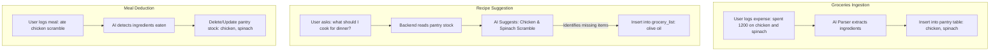

# Premium Accuracy & Capability Optimization Plan

This document outlines the architecture, database adjustments, and execution steps for upgrading the Second Brain AI Coach to a bulletproof, mathematically precise, and calendar-aware system.

---

## Technical Specifications

### 1. 🎯 Multi-Category RAG Routing
* **Goal:** Prevent context dilution while maintaining correlation capability (e.g., matching cheat meals *and* sleep logs together).
* **Implementation:**
  - The query classifier returns an **array** of category tags (e.g., `['meal', 'sleep']`).
  - The Supabase retrieval RPC is updated to accept an array filter:
    `WHERE category = ANY(filter_categories)`

```mermaid
graph TD
    Query[User: Cheat meals vs Sleep quality] --> Classify[Classifier LLM step]
    Classify -->|Outputs Array| Array[category = ['meal', 'sleep']]
    Array --> RPC[Supabase RPC with category filter]
    RPC -->|Retrieves only meal and sleep entries| Context[LLM Context Generator]
```

---

### 2. 📊 Programmatic Daily Metric Feed (Macro-RAG)
* **Goal:** Enable precise mathematical calculation of averages, totals, and trends (e.g., sleep averages, expense totals) without LLM date-math hallucinations.
* **Implementation:**
  - Query the past 30 days of logs dynamically in the Deno backend and pre-aggregate them into a daily metrics calendar context (Calories eaten, sleep hours, active minutes, step counts, hydration ml, mood score, expenses).
  - Ingest this structured table directly into the query prompt:
    ```text
    Date: 2026-07-11 | Calories: 1800 kcal | Sleep: 6.2 hrs (Poor) | Steps: 8500 | Water: 1200ml | Mood: 5.5 (tired)
    ```
  - The LLM performs calculations using this clean pre-calculated timeline, guaranteeing 100% mathematical correctness.

---

### 3. 📅 Calendar Event Column (`event_date`)
* **Goal:** Guarantee exact recall for scheduled tasks, tests, and future deadlines (e.g. *"what exams do I have in the next 10 days?"*).
* **Implementation:**
  - Add an `event_date` column to the `entries` table:
    `ALTER TABLE public.entries ADD COLUMN event_date DATE NULL;`
  - When saving logs in the `"other"` category, the LLM extracts any referenced dates and stores them in `event_date`.
  - When querying relative schedules, the system runs a direct query matching the event date range.

---

### 4. 🥦 AI Smart Recipe Builder & Pantry Tracker
* **Goal:** Transform the Coach into an active kitchen assistant that tracks fresh ingredient expiration, builds custom recipes, and auto-generates shopping checklists.
* **Flow & Data Architecture:**



#### Database Schema:
```sql
-- Virtual Pantry Table
CREATE TABLE public.pantry (
  id UUID DEFAULT gen_random_uuid() PRIMARY KEY,
  user_id INT NOT NULL,
  item_name TEXT NOT NULL,
  category TEXT DEFAULT 'other', -- 'protein', 'vegetable', 'dairy', 'grain', etc.
  quantity TEXT,                -- '500g', '6 items', etc.
  added_at TIMESTAMPTZ DEFAULT NOW(),
  estimated_expiry DATE,        -- AI resolves this based on shelf-life averages
  CONSTRAINT fk_pantry_user FOREIGN KEY (user_id) REFERENCES auth.users(id) ON DELETE CASCADE
);

-- Smart Shopping Checklist Table
CREATE TABLE public.grocery_list (
  id UUID DEFAULT gen_random_uuid() PRIMARY KEY,
  user_id INT NOT NULL,
  item_name TEXT NOT NULL,
  quantity TEXT,
  checked BOOLEAN DEFAULT FALSE,
  added_at TIMESTAMPTZ DEFAULT NOW(),
  CONSTRAINT fk_grocery_user FOREIGN KEY (user_id) REFERENCES auth.users(id) ON DELETE CASCADE
);
```

#### Deno Edge Contract (Auto-Ingestion & Deduction JSON structures):
* **Grocery Expense Log:**
  ```json
  {
    "category": "expense",
    "data": { "amount": 1200, "description": "Supermarket" },
    "pantry_additions": [
      { "item_name": "chicken breast", "category": "protein", "estimated_expiry_days": 3 },
      { "item_name": "spinach", "category": "vegetable", "estimated_expiry_days": 5 }
    ]
  }
  ```
* **Meal Consumption Log:**
  ```json
  {
    "category": "meal",
    "data": { "meal_type": "dinner", "items": ["chicken", "spinach"] },
    "pantry_deductions": ["chicken", "spinach"]
  }
  ```

---

## 📋 Scenario Walkthroughs & Examples

### Scenario 1: Grocery Shopping & Auto-Ingestion
* **User Message:** *"Spent ₹1800 at supermarket on 1kg chicken breast, fresh baby spinach, a carton of milk, and 12 eggs."*
* **AI Processing:** 
  1. The LLM parses the message, registers the expense category, and extracts the grocery items.
  2. The LLM estimates the shelf life of each fresh item (e.g. spinach expires in 5 days, chicken in 3 days) using the current date anchor.
* **Database State Change:**
  - **`public.entries`**: Inserts a new expense log of `₹1800` (subcategory: food).
  - **`public.pantry`**: Inserts four new rows:
    1. `chicken breast` | Category: `protein` | Expiry: `2026-07-14`
    2. `baby spinach` | Category: `vegetable` | Expiry: `2026-07-16`
    3. `milk` | Category: `dairy` | Expiry: `2026-07-18`
    4. `eggs` | Category: `dairy` | Expiry: `2026-07-25`
* **AI Coach Response:** *"I've logged your ₹1,800 expense for groceries and added chicken breast, baby spinach, milk, and eggs to your virtual pantry. Let's make sure we cook that spinach before July 16!"*

---

### Scenario 2: Smart Cooking Suggestion & Shopping Checklist
* **User Message:** *"Confused what to cook for dinner tonight. Give me a high-protein suggestion."*
* **AI Processing:**
  1. Deno queries `public.pantry` and retrieves current stock:
     - `chicken breast` (expiring in 2 days)
     - `baby spinach` (expiring in 4 days)
     - `eggs` (expiring in 13 days)
  2. The AI realizes `chicken breast` is close to expiration and searches for a recipe. It designs a "Spinach and Chicken Egg Scramble", but notes that **Olive Oil** is needed for cooking and is not in the pantry.
* **Database State Change:**
  - **`public.grocery_list`**: Automatically appends a checklist item:
    - `olive oil` | Quantity: `1 bottle` | Checked: `FALSE`
* **AI Coach Response:** *"Since your chicken breast is expiring in 2 days, I suggest a high-protein Spinach & Chicken Scramble (480 kcal, 45g protein)! I've added **Olive Oil** to your shopping list since you don't have it logged in stock. Ready to cook?"*

---

### Scenario 3: Eating & Auto-Deduction
* **User Message:** *"I cooked the chicken spinach scramble for dinner."*
* **AI Processing:**
  1. The LLM recognizes a meal log, categorizes it, and maps it.
  2. The LLM outputs `pantry_deductions: ["chicken breast", "baby spinach", "eggs"]`.
* **Database State Change:**
  - **`public.entries`**: Inserts a new meal log.
  - **`public.pantry`**: Triggers a query to delete or deduct the specified quantities of `chicken breast`, `baby spinach`, and `eggs` from the user's active inventory.
* **AI Coach Response:** *"Excellent dinner choice, Sudhakar! I've logged your high-protein scramble (480 kcal) and updated your pantry to remove the chicken breast, baby spinach, and eggs you used. Keep up the clean eating!"*
